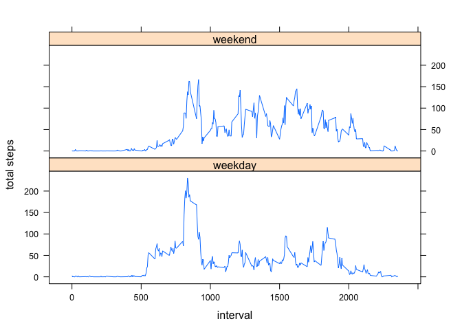

# Reproducible Research: Peer Assessment 1


## Loading and preprocessing the data
### Loading the data

```r
data<-read.csv("activity.csv")
```

### Preprocessing the data

```r
data$date<-as.Date(data$date, format="%Y-%m-%d")
total<-aggregate(data$steps, by=list(data$date), sum)
names(total)[1]<-"daily"
names(total)[2]<-"steps"
x<-aggregate(data$steps, by=list(data$interval), sum, na.rm=T, na.action=NULL)
names(x)[1]<-"interval"
names(x)[2]<-"steps"
y<-aggregate(data$steps, by=list(data$interval),mean, na.rm=T, na.action=NULL)
names(y)[1]<-"interval"
names(y)[2]<-"mean"
```


## What is mean total number of steps taken per day?

```r
hist(total$steps, main="Total number of steps per day", xlab="total steps per day")
```

 

```r
mean(total$steps, na.rm=T)
```

```
## [1] 10766
```

##What is the median total number of steps taken per day?

```r
median(total$steps, na.rm=T)
```

```
## [1] 10765
```


## What is the average daily activity pattern?

```r
plot(y$interval, y$mean, type="n", main="Daily Activity Pattern", xlab="5 mins interval", ylab="Average steps")
lines(y$interval, y$mean, type="l")
```

 

###Maximum Number of steps

```r
y[which.max(y$mean),1]
```

```
## [1] 835
```

## Imputing missing values
sum up the missing values

```r
sum(is.na(data$steps))
```

```
## [1] 2304
```


```r
missing<-merge(data,y,by="interval", sort=F)
missing<-missing[with(missing, order(date,interval)),]
missing$steps[is.na(missing$steps)]<-missing$mean[is.na(missing$steps)]
missing$mean<-NULL
head(missing)
```

```
##     interval   steps       date
## 1          0 1.71698 2012-10-01
## 63         5 0.33962 2012-10-01
## 128       10 0.13208 2012-10-01
## 205       15 0.15094 2012-10-01
## 264       20 0.07547 2012-10-01
## 327       25 2.09434 2012-10-01
```


```r
missingNew<-missing[,c(2,3,1)]
```

###Histogram of total step number

```r
a<-aggregate(missingNew$steps, by=list(missingNew$date), sum)
names(a)[1]<-"day"
names(a)[2]<-"steps"
```


```r
hist(a$steps, main="Total steps per day", xlab="total steps")
```

 

###Mean and median total steps per day

```r
median(a$steps, na.rm=T)
```

```
## [1] 10766
```


```r
par(mfrow=c(1,2))

hist(missingNew$steps, main="total steps per day(with NAs)",xlab="total steps")
hist(a$steps, main="total steps per day (No NAs)",xlab="total steps")
```

 


## Are there differences in activity patterns between weekdays and weekends?

```r
b<-missingNew
b_days<-factor(format(b$date,'%A'))
levels(b_days)
```

```
## [1] "Friday"    "Monday"    "Saturday"  "Sunday"    "Thursday"  "Tuesday"  
## [7] "Wednesday"
```

```r
levels(b_days)<-list("weekday"=c("Monday","Tuesday","Wednesday","Thursday","Friday"), "weekend"=c("Saturday","Sunday"))

b_interval_mean<-aggregate(b$steps, by=list(b_days,b$interval),mean, na.rm=T,na.action=NULL)
names(b_interval_mean)[1]<-"weekday"
names(b_interval_mean)[2]<-"interval"
names(b_interval_mean)[3]<-"mean_steps"
library(lattice)
xyplot(b_interval_mean$mean_steps~b_interval_mean$interval | b_interval_mean$weekday, layout=c(1,2), type="l",xlab="interval",ylab="total steps")
```

 
